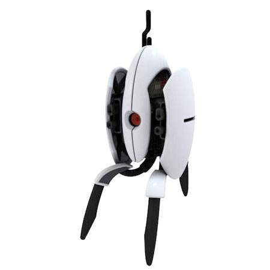

# Shooty
 "Shooty" (short for "Rooty Tooty Point-and-Shooty") is an autonomous paintball sentry platform, powered by OpenCV for Python3 on Raspberry Pi. It can be easily modified to use airsoft or Nerf guns.

**NOTE: This project is a _work in progress_. As of this writing (February-ish 2018), none of this is working yet. Caveat Emptor, and pull requests are welcome.**

## General Algorithm
* Use OpenCV frame-to-frame comparison to determine if there is a target in the frame. A target is the largest contiguous "blob" of changed pixels from one frame to the next (motion-based tracking).
* Also look for the disable signal (stop sign, specific t-shirt logo, etc). When the disable signal is in the frame, the gun is made safe, and will not fire except by manually pulling the trigger.
* Given the coordinates in the video frame of the thing we want to hit, translate that into elevation / range angles in our field of fire, and move the servos to "aim".
* Pull the trigger.
* Rinse, repeat.

## Future Improvements
* Use laser pointer to auto-calibrate or autocorrect aiming / target leading.
* Use a PID loop or Kalman filter (or something else?) to aim, instead of direct-drive servo movement.
* Add controls for windage and elevation.
* Stereo cameras, for target distance estimation and auto-elevation correction

## Components
* [Raspberry PI 3](https://www.raspberrypi.org/products/raspberry-pi-3-model-b/), running Raspbian Stretch
* [Adafruit Servo Hat](https://www.adafruit.com/product/2327)
* [Castle creations 10A BEC](http://www.castlecreations.com/en/cc-bec-010-0004-00)
* 2x [Hitec HS-5625MG servos](http://hitecrcd.com/products/servos/sport-servos/digital-sport-servos/hs-5625mg-high-speed-metal-gear-servo/product)
* ServoCity Pan-tilt kit:
  * [SPT200 Pan & Tilt Kit](https://www.servocity.com/spt200) (24-tooth spline)
  * [Direct Drive Pan Mount](https://www.servocity.com/ddp-bm)
  * [1/4"-20 Round Screw Plate](https://www.servocity.com/0-250-20-round-screw-plate)
* [Pi Camera board](https://www.adafruit.com/product/3099)
* [Tripod](https://www.amazon.com/dp/B005KP473Q)
* Enclosure: I used this [Pelican 1040 case](https://www.amazon.com/dp/B002E9GQEE), and mounted it to the front of the tripod platform using an L-bracket.
* Battery: I used [this 2S LiPo](https://hobbyking.com/en_us/turnigy-nano-tech-ultimate-4600mah-2s2p-90c-hardcase-lipo-short-pack-roar-brca-approved.html). This battery is probably overkill for this project, but I liked it because it was the right dimensions to fit into the enclosure I chose, the right voltage to drive the regulator to 5V / 10A, and it has capacity and discharge rate to spare.
* Paintball gun, with an "E-Trigger". I used the [SmartParts Ion](http://www.ebay.com/bhp/ion-paintball-gun), which you can get for pretty cheap on eBay. I mounted the [CO2 tank](https://www.amazon.com/dp/B01N1XA944) on one of the tripod legs, and used a [hose](https://www.amazon.com/dp/B0000B37UH) to connect it to the actual gun. This removes some of the rotating mass from the gimbal setup, putting less strain on the servos, but moves the center of gravity forward, making the gun harder to balance in the beginning. On the plus side, it prevents the center of gravity from moving as the tank empties over time.
* (Optional) [Laser sight](https://www.amazon.com/gp/product/B00X356WZQ), mounted to the [barrel](https://www.amazon.com/gp/product/B01DQCWOR0), for calibration, and eventual PID / Kalman filter integration.
* (Optional) Hard Shutdown switch. Something like [this](https://www.sparkfun.com/products/11138) would work. Wiring this directly into the positive output from the battery lead will power-down the entire system.
* (Optional, but strongly recommended) Power LED, so I can tell when the damn thing is on.
* (Optional) Speaker, for making fun, Team-Fortress-inspired sentry gun noises. I used:
  * This [speaker](https://www.adafruit.com/product/1674), mounted to the inside of the enclosure.
  * This [amplifier](https://www.adafruit.com/product/2130), for driving the speaker from the RPi's underpowered audio jack.
